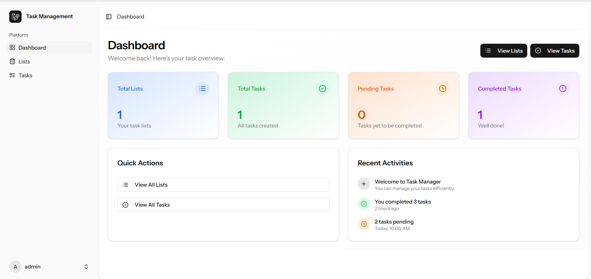

# 🚀 Task Manager App — Laravel 12 + React Starter Kit

A lightweight Task & List Manager starter built with **Laravel 12**, **React (via Inertia.js)**, **Vite**, and **Tailwind CSS** — ideal for building a fast task/list management application with an SSR-like UX powered by Inertia.



---

## ⚙️ Features
- Basic authentication (register / login / logout)  
- Task CRUD (create / read / update / delete)  
- Lists / Projects to group tasks  
- Mark as completed / due date / priority  
- Responsive UI with Tailwind CSS  
- SPA-like navigation via Inertia.js (React)

> Note: actual features may vary depending on the repo implementation. Adjust this section according to what your project really has.

---

## 📦 Tech Stack
- **Backend:** Laravel 12  
- **Frontend:** React (Inertia.js)  
- **Bundler:** Vite  
- **Styling:** Tailwind CSS  
- **Database:** MySQL / PostgreSQL / SQLite (choose as needed)  
- Optional: Laravel Breeze / Jetstream (if used for authentication)

---

# 🚀 Quick Start (Local)

Follow these steps to run the application locally.

### Prerequisites
- PHP 8.x (as required by Laravel 12)  
- Composer  
- Node.js & npm / pnpm / yarn  
- Database (MySQL / PostgreSQL / SQLite)

### 1 — Clone the repository
```bash
git clone <https://github.com/fajarsid/task-management.git>
cd <repo-folder>
```

### 2 — Install PHP dependencies
```bash
composer install
```

### 3 — Copy environment file
```bash
cp .env.example .env
```
Edit `.env` according to your configuration (DB, MAIL, etc).

### 4 — Generate app key
```bash
php artisan key:generate
```

### 5 — Run migration & seeder
```bash
php artisan migrate
# (optional) if you have seeders:
php artisan db:seed
```

### 6 — Install frontend dependencies
```bash
npm install
# or
yarn
# pnpm install
```

### 7 — Run the development server
Start Laravel backend:
```bash
php artisan serve --host=127.0.0.1 --port=8000
```

Start Vite (frontend):
```bash
npm run dev
# or
yarn dev
# pnpm dev
```

Open in browser: `http://127.0.0.1:8000`

---

# 🏗️ Build & Production

### 1 — Set environment to production
Ensure `.env` contains `APP_ENV=production`, database configuration, and `APP_URL` set to your domain.

### 2 — Compile assets
```bash
npm run build
# or yarn build / pnpm build
```

### 3 — Basic deploy steps
- Upload code to server / CI  
- Run `composer install --no-dev --optimize-autoloader`  
- Run `php artisan migrate --force`  
- Ensure proper permissions for `storage` & `bootstrap/cache`  
- Configure web server (Nginx/Apache) to point to `public/`  
- Make sure production environment variables are set properly and queue/scheduler (if any) are configured

---

# 🧪 Testing
(if tests exist)
```bash
php artisan test
# or
vendor/bin/phpunit
```

---

# 📂 Project Structure (example)
```
app/
 ├─ Http/
 │  ├─ Controllers/
 │  └─ ...
resources/
 ├─ js/
 │  ├─ Pages/        # Inertia React pages
 │  ├─ Components/
 │  └─ app.jsx
 ├─ css/
 └─ views/           # fallback (if needed)
routes/
 ├─ web.php
database/
 ├─ migrations/
 └─ seeders/
```

---

# 💡 Tips & Notes
- If using Inertia + React, ensure adapters are installed (`@inertiajs/inertia`, `@inertiajs/inertia-react`) and root React is configured in `resources/js/app.jsx`.  
- Use `laravel-vite-plugin` to integrate Vite with Laravel.  
- For quick auth setup: consider Laravel Breeze with React stack (`composer require laravel/breeze --dev && php artisan breeze:install react`) then `npm install && npm run dev`.  
- Use `dotenv` variables for Vite if you need a dev server URL (e.g., `VITE_DEV_URL`).  

---

# 🤝 Contributing
1. Fork the repo  
2. Create a feature branch: `git checkout -b feature/your-feature-name`  
3. Commit & push  
4. Open a Pull Request and describe your changes + testing steps  

---

# 📜 License
Project license — adjust accordingly. Example: MIT
```
MIT License
```

---

# 🙌 Acknowledgements
- Laravel  
- Inertia.js  
- React  
- Vite  
- Tailwind CSS  
